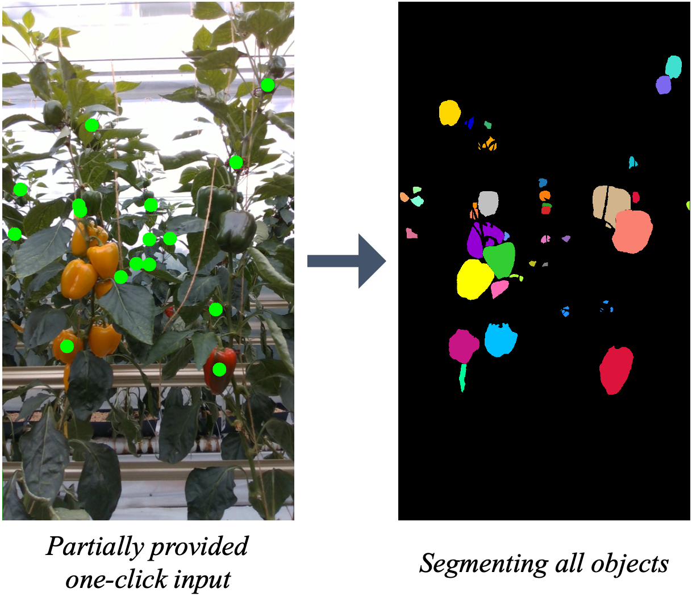
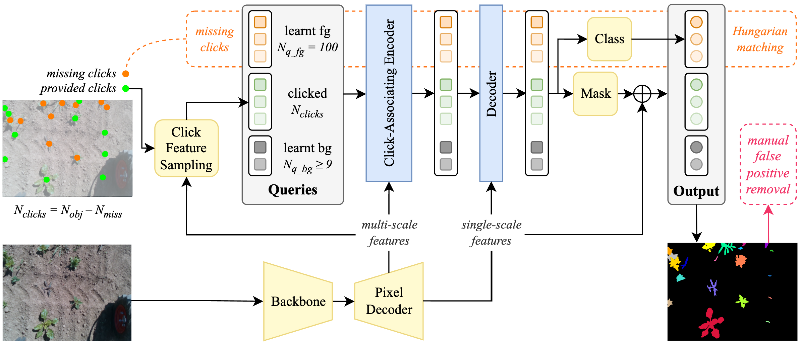

# <div align="center">DropClick:<br>Semi-Automated One-Click Segmentation<br>for Agricultural Robotic Data<br>(ICRA 2026)

<div align="center">

**Patrick Zimmer**<sup>1</sup>, **Michael Halstead**<sup>1</sup>, **Chris McCool**<sup>2</sup>\
<sup>1</sup>**[Agricultural Robotics and Engineering, University of Bonn, Germany](https://agrobotics.uni-bonn.de/)**\
<sup>2</sup>**[CSIRO Robotics, Australia](https://research.csiro.au/robotics)**

[](https://ieeexplore.ieee.org/xpl/conhome/1000639/all-proceedings)
[](https://arxiv.org/abs/2609.03680)
[](#citing-dropclick)

</div>

<div align="center">
  
</div>

## Abstract

Labelling vision datasets, especially for segmentation tasks, is a laborious and costly process. We present DropClick, a click-guided segmentation tool that simplifies the annotation process. DropClick stands out as it is a semi-automated approach and does not require a click for every object in the scene. It can therefore further reduce the required amount of user input drastically.
<br><br>

<div align="center">
  
</div>


## Installation

This repository is built on Python 3.10 and CUDA 12.8, using the following installation steps:
```
python3.10 -m venv .venv
. .venv/bin/activate
pip install --upgrade pip
pip install torch==2.7.0 torchvision==0.22.0 torchaudio==2.7.0 --index-url https://download.pytorch.org/whl/cu128
pip install wheel urllib3==1.26.16
python -m pip install git+https://github.com/facebookresearch/detectron2.git@60944b7e42f59f090e9f1d8ecdee1e43b7ceff75 --no-build-isolation
pip install -r requirements.txt
export CUDA_HOME=/usr/local/cuda-12.8
cd dropclick/modeling/pixel_decoder/ops
rm -r ./build
sh make.sh
```

## Getting started
The code can be run via `/run_train.sh`, `/run_finetune.sh`, `/run_eval.sh` scripts, datasets and model parameters can be selected/set in there. We provide pre-trained weights below; these can be used to directly and quickly run finetuning to your specific dataset/task, without the need to re-run training on COCO/LVIS.


## Model Checkpoints
We provide pre-trained weights on [COCO/LVIS](https://uni-bonn.sciebo.de/s/DKSLeWDprnJmCYe), as well as fine-tuned weights on the [*SB20*](https://uni-bonn.sciebo.de/s/ZzHeRFZqkEgL6gC) and [*BUP20*](https://uni-bonn.sciebo.de/s/6Q6EQ3A5gkdZj4w) datasets evaluated in the paper; simply use the following directory structure: `/output/<lvis|sb20|bup20>/v0/<files>`.
In order to re-train on COCO/LVIS (not necessary for finetuning on your custom datasets), you need download the original backbone weights `swin_large_patch4_window12_384_22k.pth` and convert them using `weights/convert-pretrained-swin-model-to-d2.py`.


## Datasets
For COCO/LVIS, please follow the instructions from [DynaMITe](https://github.com/amitrana001/DynaMITe).\
Our *SB20* and *BUP20* datasets can be downloaded [here](https://uni-bonn.sciebo.de/s/ZeeNRH4RN9Gp3pi) and [here](https://uni-bonn.sciebo.de/s/qEXqqeEo7bWLbcr), and need to be stored as `/datasets/<dataset>`.\
Our repository provides `/datasets/<original_dataset>_subset05imgs/<original_dataset>_subset05imgs.yaml` files that are modified from the original datasets to specify largely reduced sets of image ids (5 images) that we used to fine-tune DropClick.\
Registering our datasets for detectron2 is handled in `/dropclick/data/custom_dataset_registration` directory; look into this in order to use your own custom datasets.


### Evaluation results
Table I: One-click segmentation performance (mean object IoU) on SB20 and BUP20 evaluation sets, for baselines and DropClick. All models are trained on small subsets of 5 images from the original training sets. Minor differences in some paper results (in brackets) are reported due to a less precise previous version of our evaluator.
| *Method*                        | *SB20*      | *BUP20*     |
| :------------------------------ | :---------- | :---------- |
| SAM2 (v2.1 Large)               | 67.4        | 71.1        |
| Panoptic One-Click              | 71.9        | 58.6        |
| DropClick (all clicks provided) | 70.0        | 72.6        |
| DropClick (~50% missing)        | 69.1 (68.9) | 71.4 (71.3) |
| DropClick (no clicks provided)  | 61.8        | 58.3        |

\
Table II: DropClick mean object IoU performance and final click savings (average numbers per image) when ~50% of initial object clicks are removed during pseudo-label generation on the training sets (excluding those 5 images used to train DropClick). Minor differences in some paper results (in brackets) are reported due to a less precise previous version of our evaluator.
| *Method*            | *SB20*      | *BUP20* |
| :------------------ | :---------- | :------ |
| mIoU                | 68.9 (69.0) | 70.0    |
| *N* objects         | 19.0        | 28.5    |
| *N* objects clicked | 8.7         | 13.5    |
| *N* false positives | 1.5         | 5.9     |
| *N* clicks saved    | 8.8         | 9.1     |
| % clicks saved      | 46.3        | 31.9    |


## License
[](https://opensource.org/licenses/MIT)

The majority of DropClick is licensed under a [MIT License](LICENSE).
The codebase was adapted from [DynaMITe](https://github.com/amitrana001/DynaMITe) which is licensed under a MIT License.
It further contains elements from [Mask2Former](https://github.com/facebookresearch/Mask2Former) which is majorly licensed under MIT license along with additional licenses mentioned [here](https://github.com/facebookresearch/Mask2Former/blob/main/README.md).


## Citing DropClick
If you use our codebase then please cite our paper and further consider referencing the works in the acknowledgements below.

```BibTeX
@article{Zimmer2026arxiv,
      title={DropClick: Semi-Automated One-Click Segmentation for Agricultural Robotic Data},
      author={Zimmer, Patrick and Halstead, Michael and McCool, Chris},
      booktitle={ICRA 2026 (accepted preprint)},
      year={2026}
}
```


## Acknowledgements
Our codebase is built on top of the [detectron2](https://github.com/facebookresearch/detectron2) framework and was adapted and inspired from [DynaMITe](https://github.com/amitrana001/DynaMITe) and [Mask2Fromer](https://github.com/facebookresearch/Mask2Former).

This work was partly funded by the Deutsche Forschungsgemeinschaft (DFG, German Research Foundation) under Germany’s Excellence Strategy - EXC 2070 – 390732324 and partly funded by the German Federal Ministry of Food and Agriculture (BMEL) through the WeedAI project.

